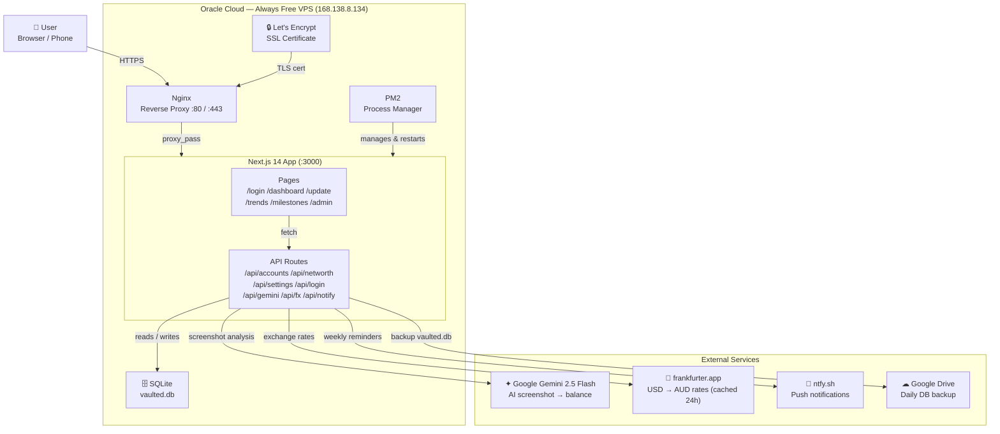

# Architecture

## System Diagram



---

## Request Flow

```
User
 └─ HTTPS request → Nginx (:443)
     └─ proxy_pass → Next.js (:3000)
         ├─ Page render  → React component
         └─ API call     → API route handler
                              └─ SQLite (local DB)
                              └─ Gemini API (AI)
                              └─ frankfurter.app (FX)
                              └─ ntfy.sh (notifications)
                              └─ Google Drive (backups)
```

---

## Data Flow — Weekly Update

```
User opens /update
 └─ Takes screenshot of bank app
     └─ Uploads screenshot → /api/gemini
         └─ Gemini 2.5 Flash reads balance from image
             └─ Returns extracted amount
                 └─ User confirms → POST /api/snapshots
                     └─ Balance saved to SQLite
                         └─ Dashboard + trends update
```

---

## Auth Flow

```
User visits any page
 └─ middleware.js checks for "vaulted_auth" cookie
     ├─ Cookie present  → allow through
     └─ Cookie missing  → redirect to /login
         └─ User enters password → POST /api/login
             └─ Compared against app_password in SQLite
                 ├─ Match   → set cookie → redirect to /dashboard
                 └─ No match → show error
```

---

## Infrastructure

| Component | Detail |
|---|---|
| Server | Oracle Cloud Always Free — VM.Standard.E2.1.Micro |
| OS | Ubuntu 22.04 LTS |
| Location | Australia Southeast (Melbourne) |
| CPU / RAM | 1 OCPU / 1 GB |
| Storage | 45 GB block storage |
| Process manager | PM2 (auto-restart + startup on reboot) |
| Web server | Nginx (reverse proxy + SSL termination) |
| SSL | Let's Encrypt (auto-renews every 90 days) |
| Database | SQLite — single file at `/home/ubuntu/vaulted/vaulted.db` |
| Cost | $0/month |
