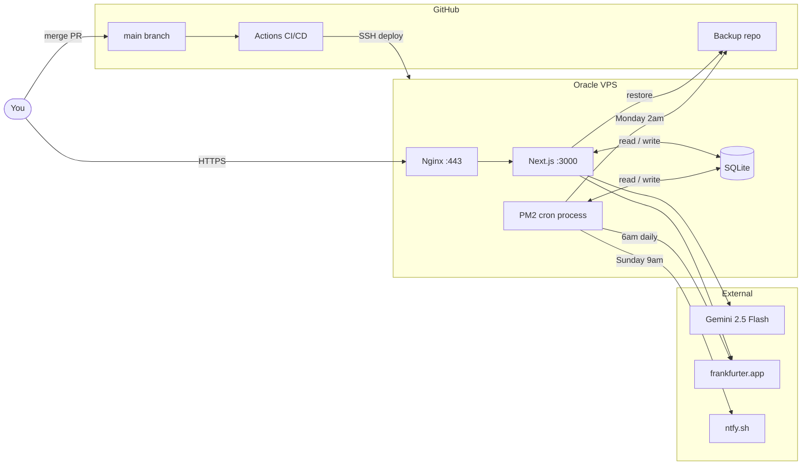

# Architecture

---

## System overview



---

## Request flow

```
Browser → HTTPS → Nginx :443
  └─ proxy_pass → Next.js :3000
      ├─ middleware.js
      │   ├─ vaulted_auth cookie present → pass through
      │   └─ missing → redirect /login (page) or 401 (API)
      ├─ Page route → React component → client render
      └─ API route → handler → SQLite
                               ├─ Gemini API (balance extraction)
                               ├─ frankfurter.app (FX rates)
                               ├─ ntfy.sh (push notification)
                               └─ GitHub API (backup read/write)
```

---

## Auth flow

```
/login → POST /api/login { password }
  └─ bcrypt compare → app_password in SQLite
      ├─ Match   → Set-Cookie: vaulted_auth (7d, httpOnly, secure, sameSite=strict)
      └─ No match → 401

All routes → middleware.js checks vaulted_auth cookie on every request
```

> Biometric lock is a client-side overlay. The session cookie stays valid while the app is locked. Biometric verifies device identity — it does not replace the session.

---

## Biometric lock flow

```
PWA launches / comes to foreground
  └─ layout.js — isPWA() check (display-mode: standalone)
      └─ webauthn_enabled = "1" → setLocked(true)
          └─ <LockScreen> shown

User taps UNLOCK
  └─ POST /api/webauthn/verify { phase: "start" }
      └─ Server: generates challenge, returns allowCredentials (all registered device IDs)
          └─ navigator.credentials.get({ publicKey: { challenge, allowCredentials } })
              └─ OS prompts Face ID / fingerprint
                  └─ POST /api/webauthn/verify { phase: "finish", id, rawId }
                      └─ Server: matches id against webauthn_credentials array
                          ├─ Match   → { ok: true } → onUnlock() → app visible
                          └─ No match → 401 → stays locked

App backgrounded (visibilitychange → hidden)
  └─ setLocked(true) → lock shown on next foreground
```

### Device registration

```
Admin → Credentials → Biometric Lock
  └─ Enter device name → tap + ADD → confirm password
      └─ POST /api/webauthn/register { phase: "start", deviceName }
          └─ Server returns challenge + excludeCredentials (prevents re-registering)
              └─ navigator.credentials.create({ publicKey })
                  └─ OS prompts biometric enrollment
                      └─ POST /api/webauthn/register { phase: "finish", credential }
                          └─ Server appends to webauthn_credentials JSON array
                              └─ Device visible in list with name + date

DELETE /api/webauthn/register { deviceId }
  └─ Removes device from array
      └─ If array empty → webauthn_enabled = "0"
```

---

## Weekly sync flow

```
User opens /update
  └─ Taps account chip
      ├─ Manual tab → type balance → SAVE BALANCE
      ├─ Screenshot tab → upload image → POST /api/gemini
      │     └─ Gemini 2.5 Flash reads balance from image
      │         └─ Returns amount + confidence → user confirms
      └─ No Change tab → confirms balance unchanged

SAVE BALANCE → POST /api/snapshots → SQLite
  └─ Balance updated on account
  └─ Net worth snapshot recorded (drives trends chart)
```

---

## DB restore flow

```
Admin → Credentials → Restore Database

  GitHub Backup
    └─ GET github.com/repos/{repo}/contents/{backup_filename}
        └─ Validate SQLite magic bytes (first 16 bytes)
            └─ Rename vaulted.db → vaulted.db.bak_{timestamp}
                └─ Write restored file → vaulted.db
                    └─ pm2 restart vaulted

  Manual Upload
    └─ File upload → same validation + swap
```

---

## CI/CD deploy flow

```
PR merged to main
  └─ GitHub Actions → SSH into VPS
      └─ PREV_COMMIT = git rev-parse HEAD
          └─ git pull → npm install --production → npm run build
              ├─ Build fails
              │   └─ git checkout PREV_COMMIT → rebuild → pm2 restart → ntfy alert
              └─ Build succeeds
                  └─ pm2 restart vaulted vaulted-cron → pm2 save
                      └─ Verify running → ntfy "Deploy successful ✓"
```

---

## Cron schedule

| Job | Schedule | Action |
|---|---|---|
| Weekly notification | Sunday 9:00 AM AEST | POST ntfy.sh — sync reminder |
| FX rate refresh | Daily 6:00 AM AEST | GET frankfurter.app → cache in DB |
| DB backup | Monday 2:00 AM AEST | Push vaulted.db → GitHub private repo |

---

## Database settings keys

| Key | Type | Description |
|---|---|---|
| `app_password` | bcrypt hash | Login password |
| `app_public_url` | string | Used in ntfy click links |
| `gemini_api_key` | string | Gemini AI key |
| `gemini_model` | string | Model name |
| `ntfy_topic` | string | ntfy topic |
| `ntfy_server` | string | ntfy server URL |
| `ntfy_password` | string | ntfy password (optional) |
| `notify_day` | string | Day of week for sync reminder |
| `github_token` | string | GitHub PAT for backup repo |
| `github_repo` | string | `username/repo-name` |
| `backup_filename` | string | DB filename in backup repo |
| `webauthn_credentials` | JSON array | Registered biometric devices |
| `webauthn_enabled` | `"0"` / `"1"` | Biometric lock on/off |
| `webauthn_pending_challenge` | JSON | Temp: registration challenge |
| `webauthn_verify_challenge` | JSON | Temp: unlock challenge |
| `owner_H_label` | string | Husband display name |
| `owner_W_label` | string | Wife display name |
| `owner_J_label` | string | Joint display name |
| `owner_H_active` | `"0"` / `"1"` | Husband tab visible |
| `owner_W_active` | `"0"` / `"1"` | Wife tab visible |
| `owner_J_active` | `"0"` / `"1"` | Joint tab visible |

---

## Infrastructure

| Component | Detail |
|---|---|
| Provider | Oracle Cloud Always Free |
| Shape | VM.Standard.E2.1.Micro |
| OS | Ubuntu 22.04 LTS |
| Region | Australia Southeast (Melbourne) |
| CPU / RAM | 1 OCPU / 1 GB |
| Storage | 45 GB block storage |
| Process manager | PM2 — cluster mode, auto-restart, startup on reboot |
| Reverse proxy | Nginx — SSL termination, proxy to :3000 |
| SSL | Let's Encrypt — auto-renews every 90 days |
| Database | SQLite at `/home/ubuntu/vaulted/vaulted.db` |
| Cost | $0/month |
