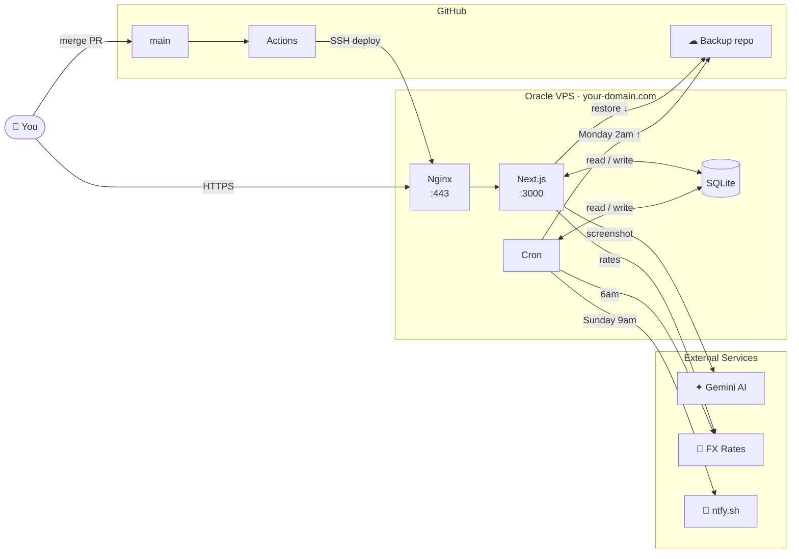

# Architecture

## System Diagram



---

## Request Flow

```
User
 └─ HTTPS request → Nginx (:443)
     └─ proxy_pass → Next.js (:3000)
         ├─ middleware.js — checks vaulted_auth cookie on every request
         │   ├─ Cookie present  → allow through
         │   └─ Cookie missing  → 401 (API) or redirect to /login (page)
         ├─ Page render  → React component
         └─ API call     → API route handler
                              └─ SQLite (local DB)
                              └─ Gemini API (AI vision)
                              └─ frankfurter.app (FX rates)
                              └─ ntfy.sh (notifications)
                              └─ GitHub private repo (backup read/write)
```

---

## Biometric Lock Flow (PWA only)

```
PWA opens / comes to foreground
 └─ layout.js checks display-mode: standalone
     └─ If PWA + webauthn_enabled = "1"
         └─ LockScreen component shown immediately
             └─ User taps UNLOCK
                 └─ POST /api/webauthn/verify { phase: "start" }
                     └─ Server issues challenge + returns all registered credential IDs
                         └─ navigator.credentials.get({ publicKey: { challenge, allowCredentials } })
                             └─ Device prompts Face ID / fingerprint
                                 └─ POST /api/webauthn/verify { phase: "finish", id, rawId }
                                     └─ Server checks id matches any registered credential
                                         ├─ Match   → { ok: true } → app unlocked
                                         └─ No match → { error } → stays locked

App backgrounded (visibilitychange → hidden)
 └─ setLocked(true) → LockScreen shown on next foreground
```

### Multi-device Registration

```
Admin → Credentials → Biometric Lock
 └─ Enter device name → tap + ADD → confirm password
     └─ POST /api/webauthn/register { phase: "start", deviceName }
         └─ Server returns challenge + excludeCredentials (existing devices)
             └─ navigator.credentials.create({ publicKey: options })
                 └─ Device prompts biometric enrollment
                     └─ POST /api/webauthn/register { phase: "finish", credential }
                         └─ Server appends new device to webauthn_credentials JSON array
                             └─ Device appears in list with name + date

Per-device removal:
 └─ Tap REMOVE next to device → confirm password
     └─ DELETE /api/webauthn/register { deviceId }
         └─ Removes that entry from array
             └─ If no devices remain → webauthn_enabled = "0"
```

---

## Deploy Flow (CI/CD)

```
Developer merges PR to main
 └─ GitHub Actions triggers
     └─ SSH into your-vps-ip
         └─ Save current commit (rollback point)
         └─ git pull + npm install + npm run build
             ├─ Build fails → git checkout prev + rebuild + pm2 restart + ntfy notification
             └─ Build succeeds → pm2 restart vaulted vaulted-cron
                 └─ Verify PM2 running → ntfy notification "Deploy successful"
```

---

## Data Flow — Weekly Update

```
User opens /update
 └─ Takes screenshot of bank app
     └─ Uploads screenshot → /api/gemini
         └─ Gemini 2.5 Flash reads balance from image
             └─ Returns extracted amount + confidence
                 └─ User confirms → POST /api/snapshots
                     └─ Balance saved to SQLite
                         └─ Dashboard + trends update
```

---

## Data Flow — DB Restore

```
Admin → Credentials → Restore Database

  Option A — GitHub Backup
    └─ Reads github_repo, github_token, backup_filename from SQLite
        └─ GET github.com/repos/{repo}/contents/{file}
            └─ Validates SQLite magic bytes
                └─ Renames live DB → vaulted.db.bak_{timestamp}
                    └─ Writes restored DB → vaulted.db
                        └─ pm2 restart vaulted

  Option B — Manual Upload
    └─ User uploads .db file via browser
        └─ Same validation + swap process
```

---

## Cron Jobs

```
vaulted-cron (PM2 process)
 ├─ Sunday 9:00 AM AEST   → POST ntfy.sh directly
 ├─ Daily  6:00 AM AEST   → GET frankfurter.app → cache FX rate in DB
 └─ Monday 2:00 AM AEST   → Push vaulted.db → GitHub private repo
```

---

## Auth Flow

```
User visits any page
 └─ middleware.js checks "vaulted_auth" cookie
     ├─ Cookie present  → allow through
     └─ Cookie missing  → redirect /login (page) or 401 (API)
         └─ User enters password → POST /api/login
             └─ bcrypt compare against app_password in SQLite
                 ├─ Match   → set vaulted_auth cookie (7 day, httpOnly, secure)
                 └─ No match → error

Note: biometric lock is a client-side overlay — the session cookie remains
valid while the app is locked. Biometric verifies identity on the device,
it does not replace the session.
```

---

## DB Settings Keys (biometric)

| Key | Value |
|---|---|
| `webauthn_credentials` | JSON array of `{ id, name, registeredAt, rawId, type, response }` |
| `webauthn_enabled` | `"1"` or `"0"` |
| `webauthn_pending_challenge` | Temp during registration (cleared after finish) |
| `webauthn_verify_challenge` | Temp during unlock (cleared after finish) |

---

## Infrastructure

| Component | Detail |
|---|---|
| Server | Oracle Cloud Always Free — VM.Standard.E2.1.Micro |
| OS | Ubuntu 22.04 LTS |
| Location | Australia Southeast (Melbourne) |
| CPU / RAM | 1 OCPU / 1 GB |
| Storage | 45 GB block storage |
| Process manager | PM2 (auto-restart + startup on reboot) |
| Web server | Nginx (reverse proxy + SSL termination) |
| SSL | Let's Encrypt (auto-renews every 90 days) |
| Database | SQLite — `/home/ubuntu/vaulted/vaulted.db` |
| CI/CD | GitHub Actions — auto-deploys on merge to main |
| Backups | GitHub private repo — Monday 2am cron |
| Cost | $0/month |
