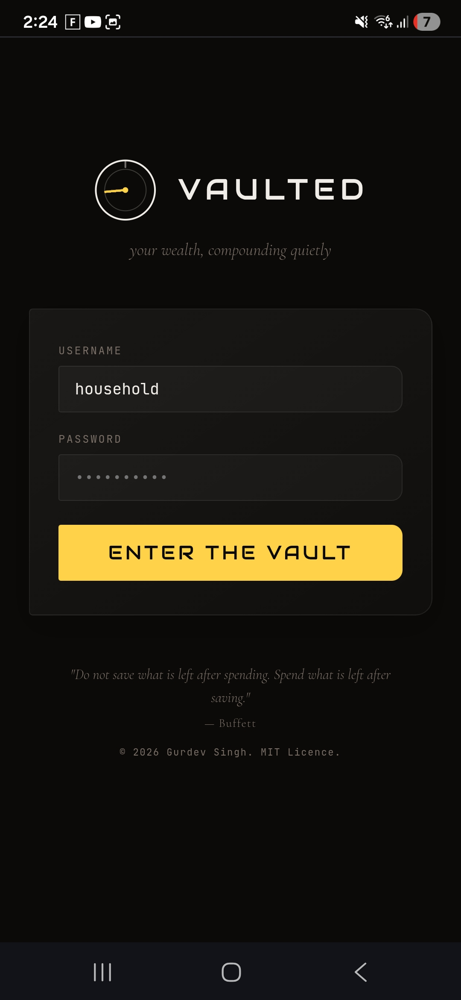
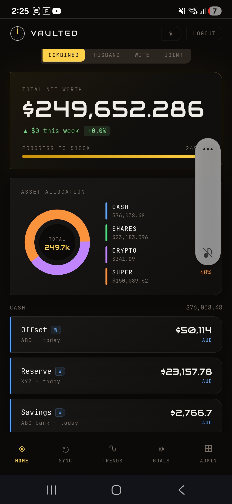
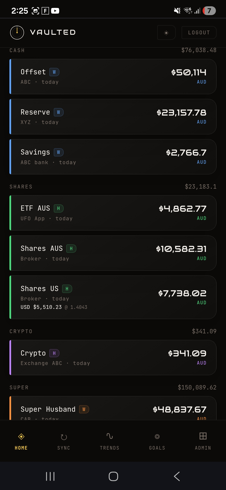
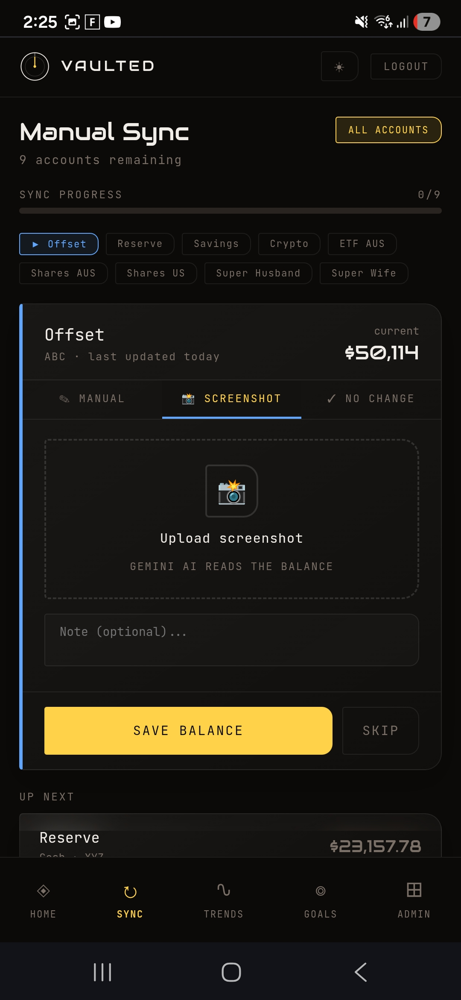
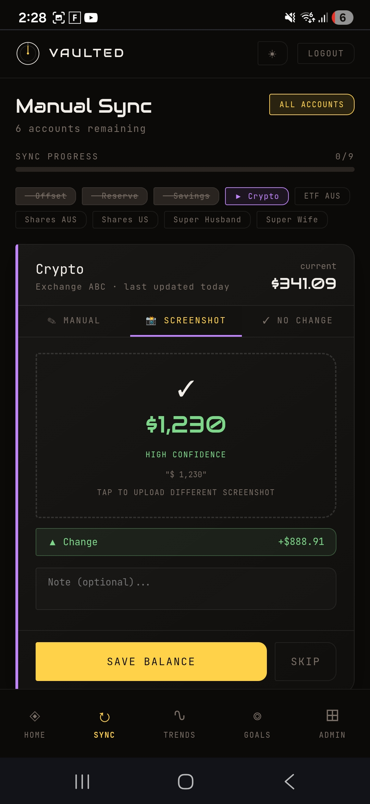
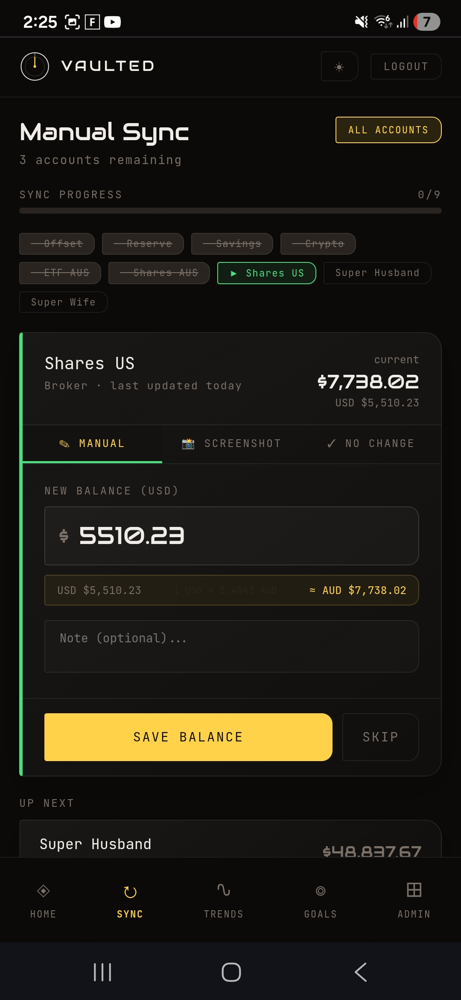
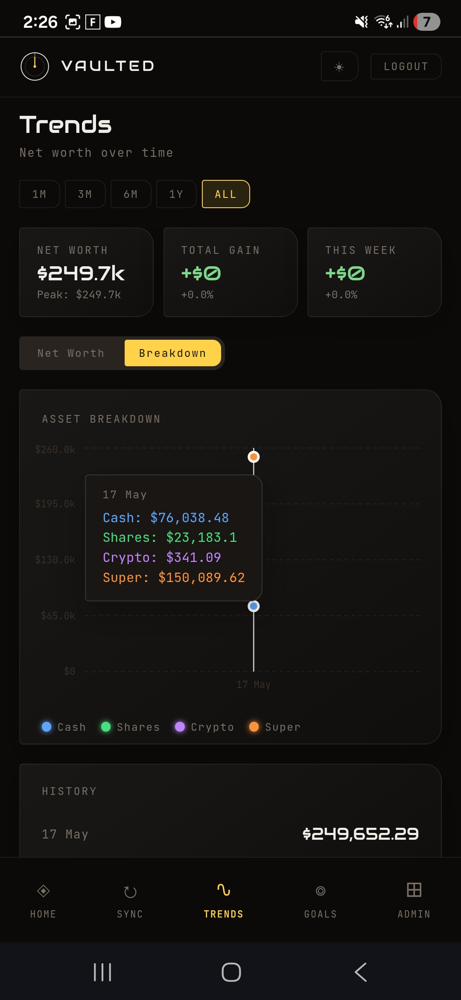
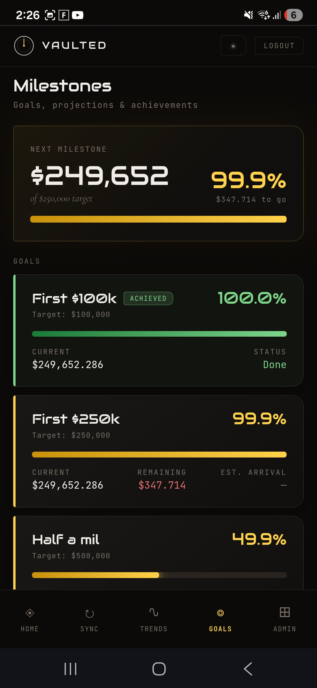
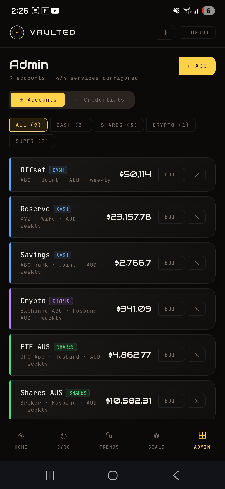

# Vaulted

Most finance apps want access to your bank. Vaulted doesn't. You take a screenshot, AI reads the balance, your net worth updates. Everything runs on your own server and costs nothing to keep running.

> 📹 **Demo video coming soon** — drop a screen recording of the live app here

---

## Screenshots

<table>
  <tr>
    <td align="center"><br/><sub>Login</sub></td>
    <td align="center"><br/><sub>Dashboard</sub></td>
    <td align="center"><br/><sub>Accounts</sub></td>
  </tr>
  <tr>
    <td align="center"><br/><sub>Manual Sync</sub></td>
    <td align="center"><br/><sub>Gemini AI Extraction</sub></td>
    <td align="center"><br/><sub>USD Conversion</sub></td>
  </tr>
  <tr>
    <td align="center"><br/><sub>Trends</sub></td>
    <td align="center"><br/><sub>Milestones</sub></td>
    <td align="center"><br/><sub>Admin</sub></td>
  </tr>
</table>


Built for a household of two. Tracks cash, shares, crypto and super across any number of accounts. Supports AUD and USD. Sends a weekly push notification to your phone when it's time to sync.

Data never leaves your server. No subscriptions. No third party access to your accounts. $0/month on Oracle Cloud Always Free.

## Use cases

**Weekly balance update**
Open the app, tap through each account due for an update. Point the camera at a balance screen — Gemini AI reads the number automatically. Or type it manually. Confirm, move on. Takes under two minutes for ten accounts.

**Net worth at a glance**
The dashboard shows total household net worth, broken down by asset class (cash, shares, crypto, super) and by owner (husband, wife, joint). AUD-equivalent totals are calculated live using cached FX rates for USD accounts.

**Tracking over time**
Trends page shows net worth history and per-account sparklines. Every time a balance is saved, a snapshot is recorded — so history builds up automatically over weeks and months.

**Milestone goals**
Set a net worth target (e.g. $500k) and watch the progress bar fill. Milestones page shows how far along you are and projects when you'll hit it based on recent growth rate.

**Overdue account alerts**
Each account has a configured update frequency (weekly, fortnightly, monthly). The app tracks when it was last updated and highlights anything overdue. On the configured day (default Sunday), a push notification fires to your phone via ntfy.sh reminding you to sync.

**Multi-currency**
USD accounts (e.g. Stake Wall St) store a native USD balance and an AUD-equivalent balance. The FX rate is fetched once daily from frankfurter.app and cached in the DB so the dashboard always shows consistent AUD totals.

**Admin and credentials**
All API keys (Gemini, ntfy, GitHub) are stored in the DB and editable via the Admin panel. No environment files needed. Cron job status (last run, result) is visible in Admin. Any job can be triggered manually with a Run Now button.

## Stack

| Layer | Tech |
|---|---|
| Frontend | Next.js 14 (App Router) |
| Backend | Next.js API Routes |
| Database | SQLite via @libsql/client |
| AI Vision | Google Gemini 2.5 Flash |
| FX Rates | frankfurter.app (cached 24h) |
| Notifications | ntfy.sh |
| Backups | GitHub private repo |
| Hosting | Oracle Cloud Always Free |
| SSL | Let's Encrypt |

## Architecture

See [ARCHITECTURE.md](ARCHITECTURE.md) for the full system diagram, request flow, auth flow, and infrastructure details.

```
User → Nginx (SSL) → Next.js (:3000) → SQLite
                          ├── Google Gemini (AI vision)
                          ├── frankfurter.app (FX rates)
                          ├── ntfy.sh (notifications)
                          └── GitHub private repo (backups)
```

## Getting started

```bash
npm install
npm run dev
```

Open [http://localhost:3000](http://localhost:3000)

## Deployment

See [DEPLOY.md](DEPLOY.md) for step-by-step instructions.

Live at: **https://vaulted.gdevsingh.com**

## Project structure

```
app/
  login/        # Login screen
  dashboard/    # Net worth overview
  update/       # Guided weekly update flow
  trends/       # Charts and history
  milestones/   # Goals and achievements
  admin/        # Account + credential management
  api/          # All backend API routes
components/
  logo.jsx      # Dial mark + Audiowide wordmark
  nav.jsx       # Bottom navigation
  top-bar.jsx   # App header
  ui/           # Shared primitives
lib/
  db.js         # SQLite client, schema, seed data
  api.js        # Fetch wrappers for all API routes
  tokens.js     # Design tokens
  utils.js      # Helper functions
```

## Status

- [x] Scaffold + design tokens + logo
- [x] Dashboard
- [x] Update flow
- [x] Trends & charts
- [x] Milestones & goals
- [x] Admin panel
- [x] Backend + SQLite
- [x] Auth (session cookie + middleware route protection)
- [x] ntfy.sh notifications
- [x] Oracle Cloud deployment
- [x] SSL via Let's Encrypt
- [x] Logout button
- [x] Cron job status panel in Admin
- [x] GitHub private repo DB backup (Monday 2am, cron-triggered)
- [x] Joint account owner type
- [x] Desktop font scaling
- [x] Gemini AI screenshot agent
- [x] No Change tab on update page
- [x] Update any account any time (not just when due)

## Design

- **Dark theme default** with light theme toggle
- **Audiowide** wordmark, **JetBrains Mono** UI, **Cormorant Garamond** accents
- Asymmetric cards (`border-radius: 3px 14px 14px 3px`)
- Gold accent `#FFD24A` (dark) / `#B87800` (light)
- Asset colours: Cash (blue), Shares (green), Crypto (purple), Super (orange)
